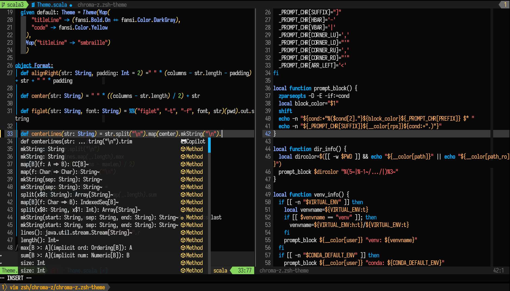

# vim-theme-chroma — Lush version

A neovim theme with vivid colors for use with [lush.nvim](https://github.com/rktjmp/lush.nvim).



For the original vimscript version, see the `legacy` branch.

## Customizing

Lush based themes can be easily modified without copying the whole theme.
See [lush.nvim's documentation](https://github.com/rktjmp/lush.nvim/blob/main/EXTEND.md#configuring-a-colorscheme-as-an-end-user) for how to do this.

## Plugin support

Chroma includes a theme for [lualine.nvim](https://github.com/nvim-lualine/lualine.nvim):

```
require('lualine').setup {
  options = { theme  = require('chroma-theme.lualine') },
	...
```
